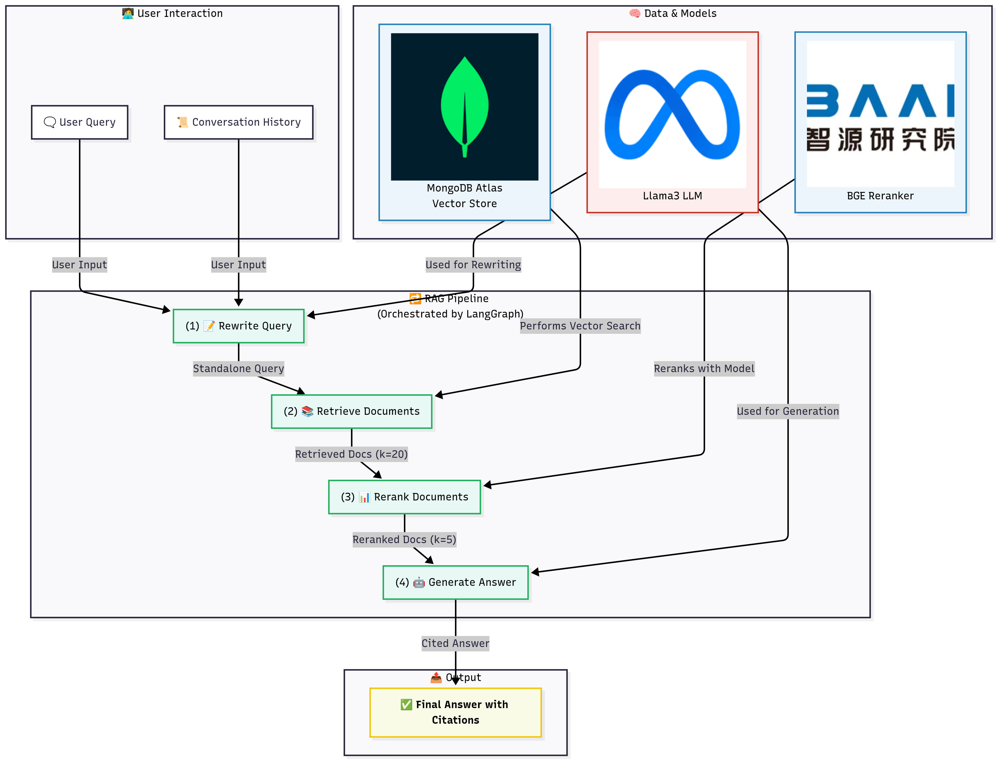

# Cybersecurity InstructRAG Assistant

[](https://pnu-rag-cybersecurity-eval.streamlit.app/)



This project implements a state-of-the-art Retrieval-Augmented Generation (RAG) system based on the ["InstructRAG"](https://arxiv.org/abs/2406.13629) concept, which prioritizes a clean, powerful pipeline of retrieval, reranking, and instruction-based generation. This version uses MongoDB Atlas as a unified backend for both document storage and vector search.

## 1. Project Architecture

The system is architected as a modular, linear pipeline orchestrated by LangGraph.

-   **Frontend (Streamlit)**: A simple web-based chat interface.
-   **Orchestration (LangGraph)**: Manages the RAG workflow: `rewrite_query` -> `retrieve_documents` -> `rerank_documents` -> `generate_answer`.
-   **Vector Store (MongoDB Atlas)**: MongoDB Atlas serves as a high-performance vector database to store and retrieve document embeddings, simplifying the tech stack.
-   **Models**:
    -   **Embedding Model**: `BAAI/bge-large-en-v1.5` for creating vector representations of text.
    -   **Reranker Model**: `BAAI/bge-reranker-large` to improve the relevance of retrieved documents.
    -   **Generation LLM**: `llama3-70b-8192` (via Groq) for query rewriting and final answer generation.

## 2. Design Rationale

Inspired by the findings in recent RAG research, this project uses a robust and efficient vector-based pipeline.

-   **InstructRAG Concept**: The core idea is to de-noise the context provided to the LLM. By retrieving a set of documents, reranking them to find the most relevant passages, and then explicitly instructing the LLM to answer *only* based on that context, we reduce hallucinations and improve factual grounding.
-   **State-of-the-Art Components**: We use highly-rated open models for embedding (`BGE-large`) and reranking (`BGE-reranker-large`) to ensure the quality of the context before it even reaches the LLM.
-   **Unified Database**: By using MongoDB Atlas for vector search, we eliminate the need for a separate vector database, simplifying setup, maintenance, and data management.

## 3. Setup and Installation

1.  **Clone & Setup Environment**:
    ```bash
    git clone https://github.com/luthfiarifin/rag-cybersecurity-eval.git
    cd rag-cybersecurity-eval
    python -m venv venv
    source venv/bin/activate
    pip install -r requirements.txt
    ```

2.  **Set Up Environment Variables**:
    Create a `.env` file and add your credentials:
    ```
    GROQ_API_KEY="your_groq_api_key"
    MONGO_URI="your_mongodb_atlas_uri_with_credentials"
    DB_NAME="cybersecurity_db"
    COLLECTION_NAME="documents_vector_store"
    ```

3.  **Add Data**: Place PDFs in the `data/pdfs/` directory.

## 4. How to Run

### Step 1: Build the Vector Store

Use the Jupyter Notebook to create and populate your MongoDB Atlas collection and vector index.

1.  **Prerequisite**: Ensure you have a Vector Search Index named `vector_index` on your MongoDB collection (`cybersecurity_db.documents_vector_store`). You can create this in the Atlas UI under the "Search" tab for your collection. A simple definition would be a dynamic index on the `embedding` field.
2.  Start Jupyter: `jupyter lab`
3.  Open `notebooks/build_vector_store.ipynb`.
4.  Run the cells to build the vector store. This only needs to be done once or when your source documents change.

### Step 2: Run the Streamlit Application

Launch the chat interface:
```bash
streamlit run app/app.py
```

### Step 3: Run the Evaluation

Use the `notebooks/evaluation.ipynb` notebook to benchmark the system's performance.

## References

- **InstructRAG Paper**: [InstructRAG: Instructing Retrieval-Augmented Generation via Self-Synthesized Rationales](https://arxiv.org/abs/2406.13629)
- **SOTA Paper**: [RAGtifier: Evaluating RAG Generation Approaches of State-of-the-Art RAG Systems for the SIGIR LiveRAG Competition](https://www.arxiv.org/pdf/2506.14412)